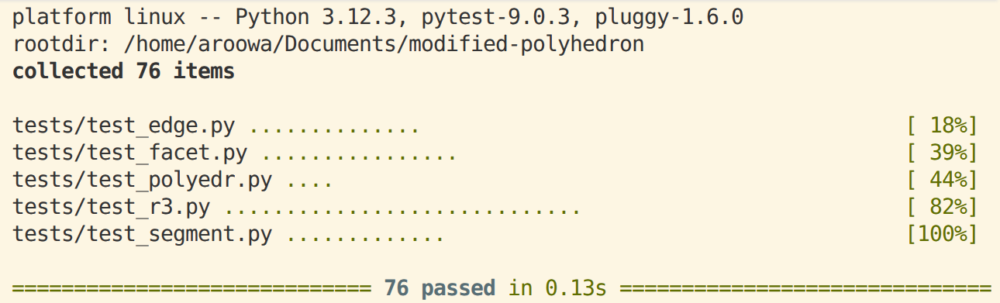

-   [Постановка задачи](#постановка-задачи)
-   [Описание решения](#описание-решения)
    - [Модификация `r3.py`](#модификация-r3py)
    - [Модификация `polyedr.py`](#модификация-polyedrpy)
    - [Изменение структуры проекта](#изменение-структуры-проекта)
-   [Некоторые тесты](#некоторые-тесты)
-   [Заключение](#заключение)

## Постановка задачи

Отчёт посвящён модификации проекта «Изображение проекции полиэдра».
Решалась задача, сформулированная следующим образом: «Назовём точку
в пространстве «хорошей», если её проекция находится строго вне
окружности $x^2+y^2=1$. Необходимо модифицировать эталонный проект таким образом,
чтобы определялась и печаталась следующая характеристика полиэдра:
сумма площадей граней, центр и хотя бы одна вершина которых — «хорошие»
точки».

Исходный программный проект реализует алгоритм построения ортогональной
проекции произвольного полиэдра на плоскость с учётом теней, отбрасываемых
его гранями. Архитектура проекта разделена на модули геометрических
примитивов, алгоритма отсечения и графического вывода.

Требуется вычислить и вывести в консоль суммарную площадь проекций всех
«хороших» граней. Площадь должна рассчитываться исключительно для
двумерной проекции грани на плоскость $XOY$. При этом визуализация
самого полиэдра должна сохраняться в исходном виде без изменения
алгоритма отсечения невидимых линий и расчёта теней.

## Описание решения

При выполнении задачи были модифицированы файлы: `r3.py`, `polyedr.py`, изменен и переименован файл запуска, 
а также добавлены тесты в `test_facet.py` и `test_polyedr.py`. Далее
мы рассмотрим модификации детально.

### Модификация `r3.py`

Исходя из постановки задачи, первоочерёдно нам нужно добавить метод,
возвращающий проекцию трёхмерной точки на плоскость $XOY$. Это необходимо
для проверки условия «хорошести» точки и вычисления площадей проекций.

~~~{.py include="./extras/code/r3_xy.py"}
~~~

Метод `xy()` возвращает кортеж из двух координат $(x, y)$, что позволяет
удобно работать с двумерными проекциями точек без необходимости каждый
раз явно обращаться к атрибутам `x` и `y` объекта `R3`. Данная функция
инкапсулирует операцию отбрасывания $Z$-компоненты и предоставляет
удобный интерфейс для дальнейших двумерных вычислений.

### Модификация `polyedr.py`

Основные изменения сосредоточены в классе `Facet`, где реализованы
два новых метода: `condition()` и `facet_area()`.

Метод `condition()` проверяет, является ли грань «хорошей». Для этого
вычисляется центр многоугольника как среднее арифметическое координат
всех вершин:

$$ c = \frac{1}{n} \sum_{i=1}^{n} v_i $$

Затем последовательно проверяется неравенство для центра и для каждой
вершины грани:

$$ x_c^2 + y_c^2 > 1 \quad \text{и} \quad \exists v_i: x_i^2 + y_i^2 > 1 $$

Если оба условия выполняются, метод возвращает логическое значение
`True`. Использование строгого неравенства гарантирует, что точки,
лежащие точно на границе окружности, не будут считаться хорошими,
что соответствует постановке задачи.

~~~{.py include="./extras/code/condition.py"}
~~~

Вычисление площади проекции выполняется в методе `facet_area()`.
Поскольку грань может быть произвольным выпуклым многоугольником,
применяется алгоритм триангуляции «веером» от первой вершины. Площадь
каждого треугольника в проекции рассчитывается по формуле ориентированной
площади, взятой по модулю:

$$ S_{\triangle} = \frac{1}{2} \left| (x_1 - x_3)(y_2 - y_3) - (y_1 - y_3)(x_2 - x_3) \right| $$

~~~{.py include="./extras/code/facet_area.py"}
~~~

Сумма площадей всех треугольников даёт полную площадь проекции грани.
Если грань не удовлетворяет условию `condition()`, метод возвращает
ноль. Это позволяет избежать ветвления на этапе агрегации результатов.

В методе `Polyedr.draw()` добавлен предварительный проход по списку
граней. На этом этапе накапливается суммарная площадь всех хороших
граней. Результат выводится в стандартный поток вывода. Далее
выполняется стандартный алгоритм расчёта теней и отрисовки рёбер,
который не зависит от новых вычислений и сохраняет обратную
совместимость.

~~~{.py include="./extras/code/draw.py"}
~~~

### Изменение структуры проекта

Относительно эталонного проекта были добавлены несколько файлов,
упрощающих работу при первом запуске в виртуальном окружении IDE:

-   `help.md` — справочная информация по использованию проекта;
-   `task.md` — полное текстовое описание условия задания;
-   `requirements.txt` — список зависимостей Python для быстрой
    установки.

Также были удалены файлы, не касающиеся модификации, а аналогичные
файлы немного изменены и переименованы. Запускать проект предполагается
с помощью файла:

~~~python
run_modification.py
~~~

## Некоторые тесты

Для верификации корректности реализации использован фреймворк `pytest`
в сочетании со стандартной библиотекой `unittest`. Тестовая стратегия
покрывает граничные случаи, проверку условия фильтрации и точность
вычисления площадей с учётом погрешностей чисел с плавающей запятой.

Сначала рассмотрим новые тесты для метода `condition()`. Здесь всё
довольно прозаично: тесты проверяют различные комбинации расположения
центра и вершин относительно единичной окружности.

~~~{.py include="./extras/code/tests/test_condition.py"}
~~~

Для метода `facet_area()` были добавлены тесты, проверяющие корректность
вычисления площади проекции. Важно отметить, что площадь должна быть
положительной только для «хороших» граней, для остальных она равна нулю.

~~~{.py include="./extras/code/tests/test_facet_area.py"}
~~~

Для класса `Polyedr` был добавлен тест на метод `draw()`, проверяющий
корректность вывода суммарной площади. В тесте создаётся искусственный
полиэдр с известными координатами вершин, и проверяется вывод программы
на соответствие аналитически рассчитанному значению площади. Захват
стандартного вывода осуществляется через `io.StringIO`, что позволяет
тестировать консольный вывод без открытия графического окна.

~~~{.py include="./extras/code/tests/test_polyedr.py"}
~~~

Ключевые проверенные сценарии включают:

1.  Грань полностью находится вне единичной окружности. Ожидается
    положительная площадь и статус `condition() == True`.
2.  Грань пересекает границу круга $x^2 + y^2 = 1$. Проверяется
    корректность фильтрации в зависимости от положения центра и вершин.
3.  Грань целиком лежит внутри круга. Площадь должна строго равняться
    нулю.
4.  Тест на точность вычислений. Используется сравнение с допуском
    `math.isclose` для избежания ложных срабатываний.

{style="width:15cm"}

На скриншоте демонстрируется успешное прохождение набора unit-тестов.
Зелёные маркеры подтверждают отсутствие регрессий в базовом алгоритме
теней и корректную работу новой функциональности расчёта площадей.

## Заключение

Таким образом, при решении данной задачи было реализовано 3 новых
метода: `xy()` в классе `R3`, `condition()` и `facet_area()` в классе
`Facet` (вспомогательный метод _area() не учитвается), а также модифицирован метод `draw()` в классе `Polyedr`.
Общий объём модификации вместе с тестами не превышает 100 строк кода.

## Команды, с помощью которых получены итоговые отчёты в заданных форматах

### Для получения HTML:

~~~

pandoc -o report.html -f markdown -t html -s \
  --template defaults/default.html5 \
  --lua-filter include-code-files.lua \
  --metadata-file=metadata.yaml \
  --mathjax \
  report.md

~~~

### Для получения PDF:

~~~

pandoc -o report.pdf -f markdown -t pdf -s \
  --template defaults/default.latex \
  --lua-filter include-code-files.lua \
  --metadata-file=metadata.yaml \
  report.md

~~~

### Для получения DOCX:

~~~

pandoc -o report.docx -f markdown -t docx \
  --lua-filter include-code-files.lua \
  --metadata-file=metadata.yaml \
  report.md

~~~