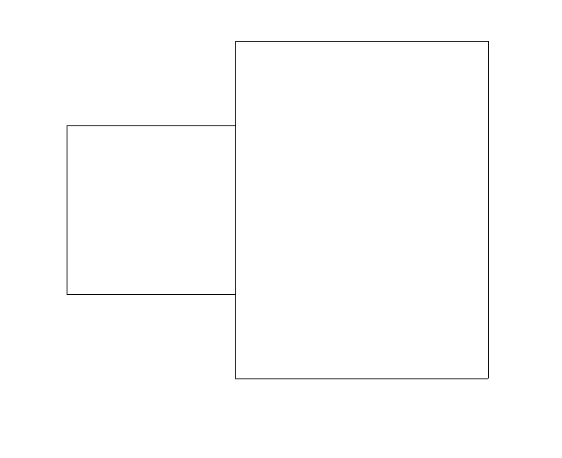
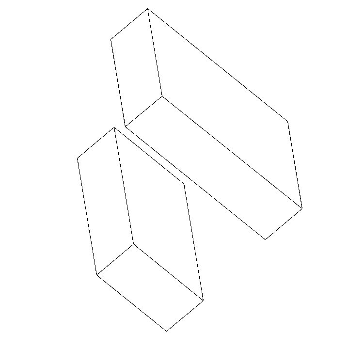

---
header-includes:
  - \usepackage[T2A]{fontenc}
  - \usepackage[utf8]{inputenc}

title: Отчёт о модификации проекта «Изображение проекции полиэдра»
author: Айвазян Лёва, Б25-205
date: 29 апреля 2026 года
---

# Введение

В рамках данного проекта рассматривается задача визуализации трёхмерных
объектов, представленных в виде полиэдров, на двухмерной плоскости. Основной целью проекта была реализация алгоритма по
удалению невидимых линий.

## Постановка задачи

В эталонный код проекта необходимо было внести изменения для расчёта
специфической характеристики полиэдра. Требуется вычислить сумму длин
невидимых частей частично видимых рёбер. При этом учитываются только
те рёбра, центр которых находится строго внутри сферы радиуса 2,
заданной уравнением:

$$x^2 + y^2 + z^2 = 4$$

Важным условием является то, что коэффициенты гомотетии и углы Эйлера
влияют только на изображение проекции, но не изменяют сам исходный
полиэдр и его метрические характеристики.


# Описание решения

В ходе реализации модификации в программу были внесены изменения,
позволяющие сохранять оригинальные координаты вершин без учёта
вращения и коэффициента гомотетии.

## Сохранение исходных данных

При считывании данных из файла, формируется дополнительный атрибут
объекта класса `Polyedr` список `orig_vertexes`, где хранятся
оригинальные точки. Это необходимо для корректного расчёта
метрических характеристик, так как экранные координаты подвергаются
искажению.
```python
elif i < nv + 2:
    # Задание всех вершин полиэдра
    x, y, z = (float(x) for x in line.split())
    self.orig_vertexes.append(R3(x, y, z))
    self.vertexes.append(R3(x, y, z).rz(
        alpha).ry(beta).rz(gamma) * c)
```

Каждое ребро (объект класса `Edge`) инициализируется с сохранением
информации как об искажённых, так и об оригинальных координатах
своих начала и конца.
```python
for n in range(size):
    self.edges.append(Edge(
        # Искажённые
        vertexes[n - 1], vertexes[n],
        # Оригинальные
        orig_vertexes[n - 1], orig_vertexes[n]
    ))
```

В конструкторе класса `Edge` для этого предусмотрены соответствующие
параметры:
```python
def __init__(self, beg, fin, orig_beg, orig_fin):
    self.beg, self.fin = beg, fin
    self.orig_beg, self.orig_fin = orig_beg, orig_fin
    self.gaps = [Segment(Edge.SBEG, Edge.SFIN)]
```

## Алгоритм расчёта невидимых частей

Основной алгоритм базируется на анализе списка `gaps`, который
содержит совокупность видимых отрезков ребра, не находящихся
в тени.

В классе `Polyedr` реализован метод `length_shadow()`, выполняющий
роль каркаса. Он отсеивает рёбра, центр которых находится
вне заданной сферы $x^2 + y^2 + z^2 < 4$. Для подходящих
рёбер вызывается метод `length_for_edge`.
```python
def length_shadow(self):
    total_sum = 0.0

    # Проходимся по всем рёбрам
    for e in self.edges:
        # Ищем центр ребра
        center = e.find_center_edge()

        # Проверяем, что центр лежит внутри сферы
        if center.x**2 + center.y**2 + center.z**2 < 4:
            # Тогда считаем длины затенённых частей
            total_sum += e.length_for_edge()

    return total_sum
```

Метод `length_for_edge` анализирует суммарную длину просветов ребра
и проверяет условие его частичной затенённости. Из полной
доли отрезка вычитается видимая часть, что позволяет вычислить долю
тени. Результат умножается на истинную длину ребра,
вычисляемую методом `distance` через скалярное произведение.
```python
def length_for_edge(self):
    summary_gap = 0.0
    # Проходимся по всем просветам ребра
    for gap in self.gaps:
        summary_gap += gap.length_for_segment()

    # Проверяем, что ребро не полностью
    # в тени или на свету
    if 0.0 < summary_gap < 1.0:
        # Возвращаем реальную длину тени
        # без учёта масштабирования
        d = self.orig_beg.distance(self.orig_fin)
        return (1.0 - summary_gap) * d

    else:
        # В противном случае не считаем
        # эту часть по требованию задачи
        return 0.0
```

```python
# Находим длину вектора между двумя точками через скалярное произведение
def distance(self, other):
    diff = self - other
    return sqrt(diff.dot(diff))
```

Итоговое значение делится пополам, так как каждое ребро принадлежит
одновременно двум граням и учитывается алгоритмом дважды.
Результат выводится в терминал:
```python
ans = p.length_shadow() / 2.0
print(f"Сумма длин невидимых частей: {ans}")
```


# Тестирование программы

Для проверки корректности алгоритма были спроектированы пять
специальных полиэдров. Каждый из них представляет собой
комбинацию из двух блоков: нижнего (целевого, на котором мы
ищем тени) и верхнего (заслонки, которая отбрасывает тень).

* **Тест №1:** Базовый случай частичного перекрытия. Нижний
  блок расположен точно по центру. Это гарантирует попадание
  центров его рёбер внутрь сферы радиуса 2. Верхняя заслонка
  нависает только над правой частью фигуры. Тест проверяет
  подсчёт длин частично затенённых рёбер.

  

  *Пример частичного перекрытия полиэдров из Теста №1*

  
  
  *Для наглядности равернем полиэдры*

  ```python
    def test_polyedr_1(self):
        """Частичное перекрытие, центр внутри сферы."""
        ans = self.get_ans("Polyedr_test1")
        self.assertEqual(ans, 8.0)
  ```

* **Тест №2:** Проверка отсутствия ложных срабатываний.
  Нижний целевой блок остаётся в пределах сферы, но верхняя
  заслонка сильно смещена вправо. В результате тень от
  верхнего блока никак не падает на нижний. Тест
  подтверждает, что при отсутствии теней на целевых рёбрах
  алгоритм корректно возвращает нулевое значение.
  ```python
    def test_polyedr_2(self):
        """Заслонка смещена, перекрытия нет или оно вне сферы."""
        ans = self.get_ans("Polyedr_test2")
        self.assertEqual(ans, 0.0)
  ```

* **Тест №3:** Проверка алгоритма при центральном перекрытии.
  Верхняя заслонка расположена прямо над центром нижнего
  блока. Она ложится ровно поперёк целевой фигуры, разрезая
  видимые рёбра на несколько фрагментов. Тест проверяет, как
  программа суммирует тени, когда рёбра делятся тенью на
  несколько видимых отрезков.
  ```python
    def test_polyedr_3(self):
        """Большая заслонка, полное или значительное перекрытие."""
        ans = self.get_ans("Polyedr_test3")
        self.assertEqual(ans, 8.0)
  ```

* **Тест №4:** Проверка отсечения объектов, лежащих вне
  заданной сферы. Обе фигуры искусственно перенесены далеко
  от начала координат. Программа должна проигнорировать все
  рёбра фигуры и вернуть строгий ноль.
  ```python
    def test_polyedr_4(self):
        """Объекты далеко, центры рёбер вне сферы."""
        ans = self.get_ans("Polyedr_test4")
        self.assertEqual(ans, 0.0)
  ```

* **Тест №5:** Проверка точности вычисления центра ребра
  при асимметричном смещении. Нижний блок смещён по осям Y
  и Z. Несмотря на это смещение, центры части рёбер всё ещё
  удовлетворяют условию $x^2 + y^2 + z^2 < 4$. Тест
  доказывает, что алгоритм не отсчитывает центр сферы от
  центра полиэдра; центр сферы всегда расположен в начале
  декартовой системы координат.

  ```python
    def test_polyedr_5(self):
        """Смещение по Y и Z, проверка точности расчёта центра."""
        ans = self.get_ans("Polyedr_test5")
        self.assertEqual(ans, 2.0)
  ```

## Команды сборки отчётов

Конвертация исходного файла в требуемые форматы выполнялась 
с помощью утилиты Pandoc следующими командами:

* **HTML:** `pandoc report.md -f markdown --template=default.html5 --mathjax -o report.html`
* **PDF:** `pandoc report.md -f markdown --template=default.latex -o report.pdf`
* **DOCX:** `pandoc report.md -f markdown -o report.docx`
